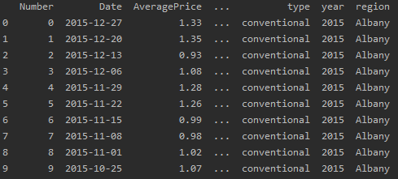
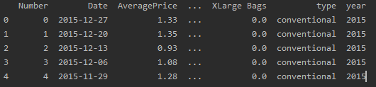
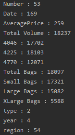
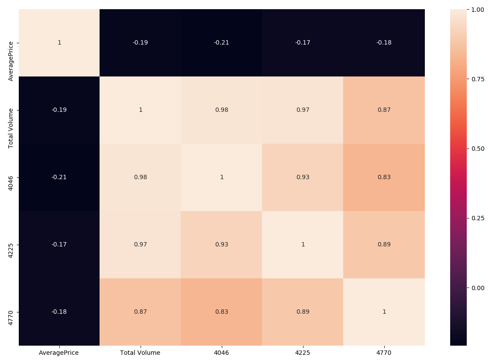
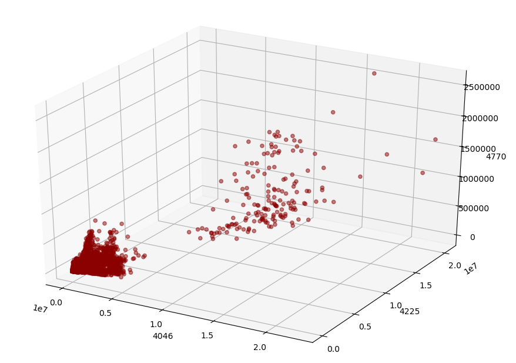
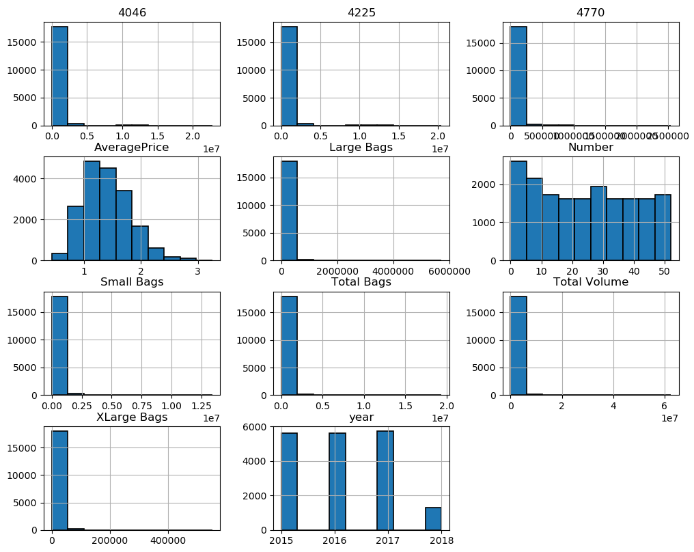
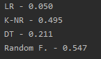

# 아보카도 가격 예측하기


## 과정

1. PLU 코드 별 아보카도 데이터를 받아오기
2. 가져온 데이터에서 불필요한 열을 삭제하기
3. 데이터를 분석하기
4. 학습시킨 후 값 예측하기


 ※ PLU코드란 :  수입 과일의 정보가 담긴 번호이다. 


## 데이터 가져오기

```python
from prediction_util import PredictionUtil
gildong = PredictionUtil()
gildong.read('avocado.csv')
```




## 데이터에서 불필요한 속성 삭제하기

```py
gildong.drop('region')
print(gildong.df.head())
```




## 데이터를 분석하기

```py
gildong.show_unique_column()
```

데이터의 열과 유니크한 값의 수를 분석하기 위해 show_unique_column 메소드를 호출합니다.




```py
gildong.heatmap(['AveragePrice', 'Total Volume', '4046', '4225', '4770'])
```

열지도를 보면,  PLU번호와 평균가격에 따른 상관관계를 나타내고 있습니다.




아보카도 4046, 4225, 4770에 대한 3d plot입니다.




히스토그램을 그려보았습니다.




## 학습시킨 후 예측하기

```py
gildong.run_all(['4046','4225','4770'], 'AveragePrice')
```

평균 가격과 상관관계가 있는 각각의 아보카도 4046, 4225, 4770을 통해 머신러닝을 수행합니다.

선형회귀, k-이웃 회귀, 결정트리, 랜덤 포레스트 회귀를 진행하였습니다.

